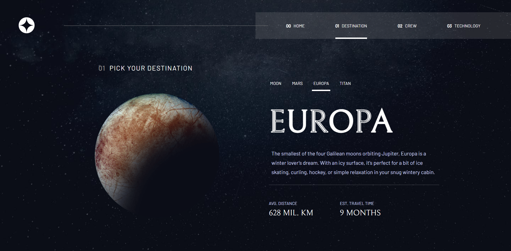

# Frontend Mentor - Space tourism website solution

This is a solution to the [Space tourism website challenge on Frontend Mentor](https://www.frontendmentor.io/challenges/space-tourism-multipage-website-gRWj1URZ3). Frontend Mentor challenges help you improve your coding skills by building realistic projects. 

## Table of contents

- [Overview](#overview)
  - [The challenge](#the-challenge)
  - [Screenshot](#screenshot)
  - [Links](#links)
- [My process](#my-process)
  - [Built with](#built-with)
  - [What I learned](#what-i-learned)
  - [Continued development](#continued-development)
  - [Useful resources](#useful-resources)
- [Author](#author)
- [Acknowledgments](#acknowledgments)

## Overview

### The challenge

Users should be able to:

- View the optimal layout for each of the website's pages depending on their device's screen size
- See hover states for all interactive elements on the page
- View each page and be able to toggle between the tabs to see new information

### Screenshot



### Links

- Solution URL: [Add solution URL here](https://github.com/ovie009/space-tourism)
- Live Site URL: [Add live site URL here](https://ovie-space-tourism.netlify.app/)

## My process
- create react app
- Navbar Component
- Home Component
- Setup Routing
- Destination Component
- Crew Component
- Added swipe to switch tabs
- Technology Component
- Mobile first CSS, then Tablet then Desktop


### Built with

- Flexbox
- CSS Grid
- Mobile-first workflow
- media queries
- [React](https://reactjs.org/) - JS library

**Note: These are just examples. Delete this note and replace the list above with your own choices**

### What I learned

- Blur background with backdrop-filter

```css
.sidebar-container{
  width: 100%;
  height: 100%;
  padding-inline: 30px;
  background: inherit;
  background-color: rgba(150, 150, 150, .2);  
  backdrop-filter: blur(30px);
}
```
- useLocation and useNavigation
- Toggling of sidebar
- Swipe to switch Tabs

```js
return useSwipeable({
  onSwiped: (e) => {
    let targetPathIndex;
    let maxIndex = linkArray.length;
    let minIndex = 0;
    let swipeDirection = e.dir;
    let forwardSlashCount = pathName.split('/').length - 1;
    if (forwardSlashCount === 1) {
      pathName = linkArray[0];
    }
    let currentPathIndex = linkArray.indexOf(pathName);

    if (swipeDirection === 'Left') {
      targetPathIndex = currentPathIndex + 1;
      if (targetPathIndex === maxIndex) {
          targetPathIndex = minIndex;
      }
      history(linkArray[targetPathIndex]);
    } else if (swipeDirection === 'Right'){
      targetPathIndex = currentPathIndex - 1;
      if (targetPathIndex < minIndex) {
          targetPathIndex = maxIndex - 1;
      }
      history(linkArray[targetPathIndex]);
    }
  }
});
```

### Continued development

- adding animations to elements onload

### Useful resources

- [Example resource 1](https://www.npmjs.com/package/react-swipeable) - This helped to detect swipe on page.
- [Example resource 2](https://www.positronx.io/react-get-dynamic-window-height-width-using-react-hooks/) - Tip on custon hook to get size of window
- [Example resource 3](https://reactrouter.com/docs/en/v6/getting-started/concepts) - Tips on useNavigation
- [Example resource 4](https://reactrouter.com/docs/en/v6/getting-started/concepts) - Tips on useNavigation
- [Example resource 5](https://reactrouter.com/docs/en/v6/getting-started/overview) - Tips on BrowserRouter
- [Example resource 6](https://youtu.be/mN3P_rv8ad4) - Tips on Sidebar design
- [Example resource 7](https://webdesign.tutsplus.com/tutorials/how-to-create-a-frosted-glass-effect-in-css--cms-32535) - Tips on frosty Sidebar background


## Author

- Website - [Iffie Ovie](https://ovie009.github.io/portfolio/)
- Frontend Mentor - [@ovie009](https://www.frontendmentor.io/profile/ovie009)
- Twitter - [@iffieOvie](https://www.twitter.com/iffieoive)

## Acknowledgments

- Ejoké - [Ejoké](https://ejovwoke.netlify.app/)
- Dev Panda - [Dev Panda](https://devpanda.netlify.app)
- Obaro - [Obaro](obarodev.herokuapp.com)
- Miné - UX suggestions and helped in debugging 
